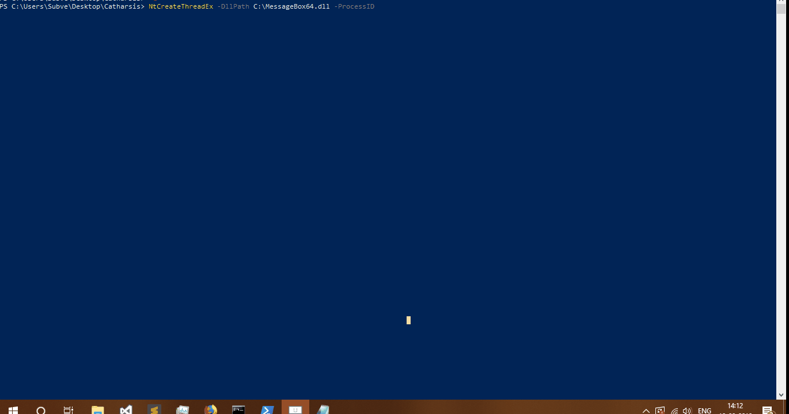

# Catharsis (Work in progress)
Raw syscall implementations with Powershell

### Brief 

This project mainly focuses on using syscalls for calling NT-functions instead of directly calling them 

To use the examples please implement the syscall number correctly according to your Windows distribution and also take note of the architecture 

#### References

https://undocumented.ntinternals.net/

https://j00ru.vexillium.org/syscalls/nt/64/

